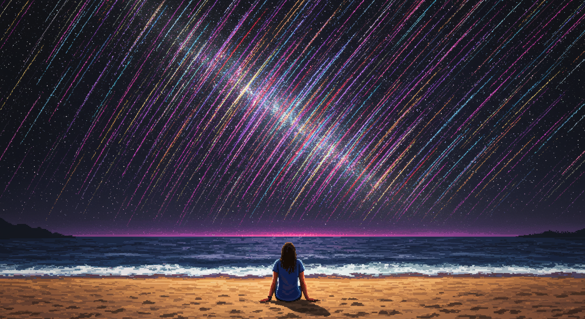

# google-imagen-3



This repository contains a Python script, `imagen.py`, that serves as an AI Image Generator leveraging Google's cutting-edge **Imagen 3** model.  Powered by the latest **Google Gen AI Python SDK (`google-genai`)**, this tool allows you to generate high-quality images from text prompts, enhanced by prompt refinement techniques.

**Imagen 3** is Google's highest quality text-to-image model, renowned for its:

*   **Exceptional Detail**: Generates images with fine detail, rich lighting, and minimal artifacts.
*   **Natural Language Understanding**:  Effectively interprets and responds to prompts written in natural, descriptive language.
*   **Style Versatility**: Creates images in a wide range of formats and artistic styles.
*   **Text Rendering**:  Superior ability to render text within generated images (though this script primarily focuses on image generation).

This script, `imagen.py`, takes your text prompt, optionally refines it using Gemini for improved results based on the provided [Imagen Prompt Guide documentation](https://ai.google.dev/gemini-api/docs/imagen-prompt-guide), and then utilizes **Imagen 3 (`imagen-3.0-generate-002`)** to generate the image, saving it locally.

## Features

*   **Powered by Imagen 3**: Utilizes Google's state-of-the-art Imagen 3 model (`imagen-3.0-generate-002`) for image generation.
*   **Google Gen AI SDK**: Built with the latest `google-genai` Python SDK, ensuring compatibility and access to the newest features.
*   **Prompt Refinement with Gemini**:  Can leverage Gemini (`gemini-2.0-flash`) to enhance user prompts based on best practices from the "Imagen Prompt Guide".
*   **Configurable Aspect Ratio**: Currently set to generate images with a widescreen 16:9 aspect ratio.
*   **Safety Filtering**: Implements `BLOCK_LOW_AND_ABOVE` safety filtering for responsible image generation.
*   **Local Image Saving**: Saves generated images as PNG files to the same directory as the script, with unique filenames to prevent overwriting.
*   **Simple User Interface**:  Takes image prompts as input directly from the command line.

## Getting Started

### Prerequisites

*   **Python 3.12+**
*   **pip** (Python package installer)
*   **Google Generative AI API Key**:  You need an API key to access Google Generative AI services. Obtain one from [Google AI for Developers](https://aistudio.google.com/app/u/0/apikey).
*   **Python Libraries**: Install the necessary libraries (see Installation).

### Installation

1.  **Clone the repository (or download as ZIP):**

    ```bash
    git clone https://github.com/llegomark/google-imagen-3.git
    cd google-imagen-3
    ```

2.  **Install required Python libraries:**

    ```bash
    pip install -r requirements.txt
    ```

    Alternatively, install them individually:

    ```bash
    pip install python-dotenv google-genai Pillow
    ```

3.  **Set up your API Key:**

    *   Create a `.env` file in the same directory as `imagen.py`.
    *   Add your Google Generative AI API key to the `.env` file:

        ```env
        GOOGLE_API_KEY=YOUR_API_KEY_HERE
        ```

        **Replace `YOUR_API_KEY_HERE` with your actual API key.**

### Usage

#### Generate an Image with `imagen.py`

1.  Run the script from your terminal:

    ```bash
    python imagen.py
    ```

2.  You will be prompted to enter an image prompt. Type your prompt and press Enter.

    ```
    === Imagen 3 Prompt Refinement and Image Generator ===
    This tool will refine your prompt using Gemini and generate an image using Imagen 3.
    The image will be saved in the same directory as this script.

    Enter your image prompt: Your Image Prompt Here (e.g., "a person setting on the beach watching meteors pixel style")
    ```

3.  The script will send your prompt to Imagen 3, generate the image, and save it as a PNG file (e.g., `your_prompt_generated_image.png`) in the same directory as `imagen.py`.

## Prompt Writing for Imagen 3

For best results with Imagen 3, consider these prompt writing tips (refer to the [Imagen Prompt Guide](https://ai.google.dev/gemini-api/docs/imagen-prompt-guide) for more detailed information):

*   **Be Descriptive**: Use detailed adjectives and adverbs to clearly describe your desired image.
*   **Provide Context**: Include background information and context to help the AI understand the scene.
*   **Specify Style**: Indicate the desired style (e.g., "photograph", "painting", "digital art", "sketch") and be as specific as possible (e.g., "watercolor painting", "black and white film noir").
*   **Consider Modifiers**: Explore photography modifiers (lighting, lens type, camera angle), art styles, and quality modifiers to fine-tune your image generation.
*   **Experiment**: Iteration is key! Try different prompts and modifiers to achieve your desired results.

## License

This project is licensed under the MIT License - see the [LICENSE](LICENSE) file for details.